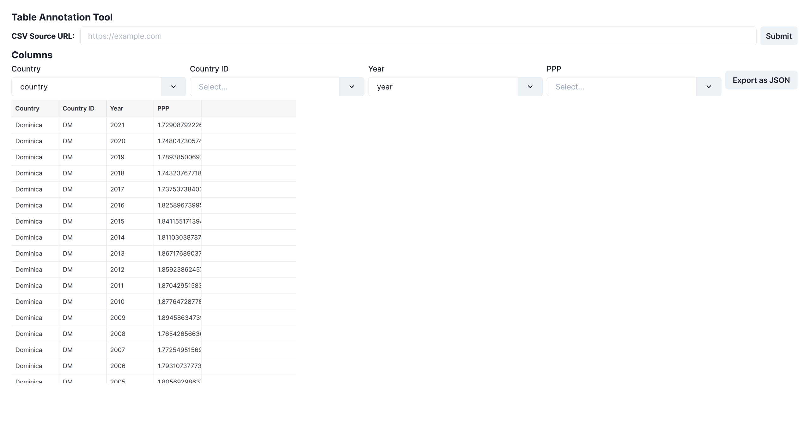

# table-annotate

A tool to annotate tabular datasets with links to wikidata entities.




## Getting Started

First, run the development server:

```bash
npm run dev
# or
yarn dev
```

Open [http://localhost:3000](http://localhost:3000) with your browser to see the result.

## todos

- [ ] Make the export feature a side panel not a modal
- [ ] Export in JSON-LD using the data cube ontology
- [ ] And in Turtle/RDF
- [ ] Better table viewer, dynamic column sizes, etc
- [ ] Support more types of table data like Excel, etc
- [ ] Allow "uploading" (just parse and show in browser) local files